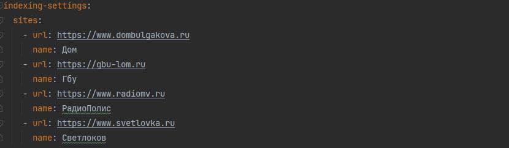
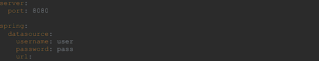
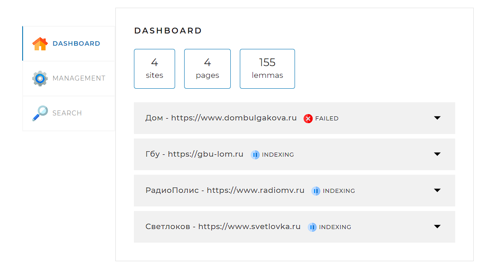
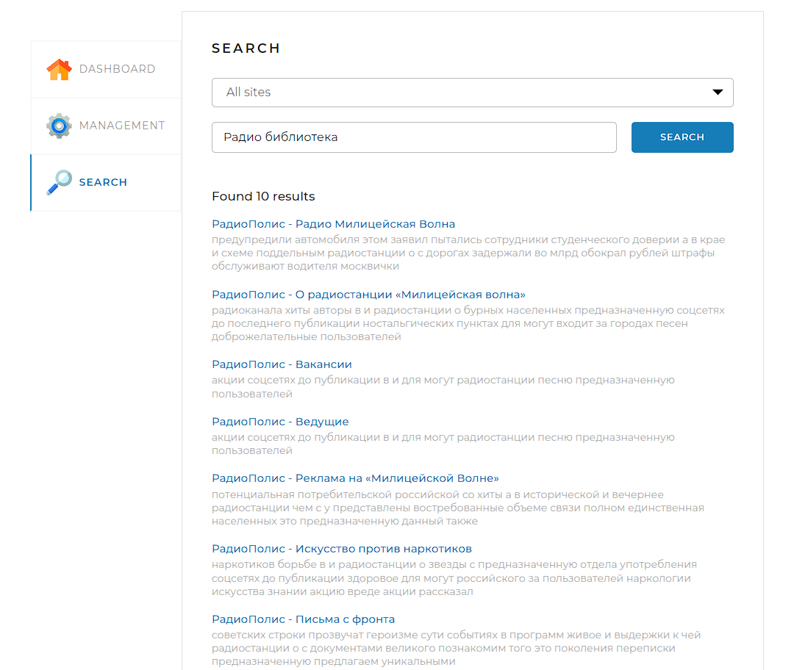

# SearchEngine

SearchEngine - это поисковый дивжок который позволяет индексировать сайты и выполнять поиск по ключевым словам. 

## Стэк
* Java 17
* Spring
* MySQL 8

## Инструкция
### Заполнить application.yaml 
* Сайтами для индексации 

* подключить локальную БД 
* заполнить поля **username** и **password** валидными данными от БД

### Использование приложения
открыть в браузере http://localhost:8080 
* вкладка DASHBOARD
* Statistics (GET /api/statistics) - Метод возвращает статистику и другую служебную информацию о состоянии поисковых индексов и самого движка.
  Если ошибок индексации того или иного сайта нет, задавать ключ error не нужно.

 Формат ответа:
{
'result': true,
'statistics': {
"total": {
"sites": 10,
"pages": 436423,
"lemmas": 5127891,
"indexing": true
},
"detailed": [
{
"url": "http://www.site.com",
"name": "Имя сайта",
"status": "INDEXED",
"statusTime": 1600160357,
"error": "Ошибка индексации: главная
страница сайта недоступна",
"pages": 5764,
"lemmas": 321115
},
...
]}
----

* вкладка MANAGEMENT
*  START INDEXING (GET /api/startIndexing) - Метод запускает полную индексацию всех сайтов или полную переиндексацию, если они уже проиндексированы.
  * Если в настоящий момент индексация или переиндексация уже запущена, метод возвращает соответствующее сообщение об ошибке.

   Формат ответа в случае успеха:
  {
  'result': true
  }

  Формат ответа в случае ошибки:
{
'result': false,
'error': "Индексация уже запущена"
}

*  STOP INDEXING (GET /api/stopIndexing) - Метод останавливает текущий процесс индексации (переиндексации). Если в настоящий момент индексация или переиндексация не происходит, метод возвращает соответствующее сообщение об ошибке.
   
 Формат ответа в случае успеха:
{
'result': true
}

 Формат ответа в случае ошибки:
{
'result': false,
'error': "Индексация не запущена"
}

*  Add/update (POST /api/indexPage) - Метод добавляет в индекс или обновляет отдельную страницу, адрес которой передан в параметре.
   Если адрес страницы передан неверно, метод должен вернуть соответствующую ошибку.
   
 Формат ответа в случае успеха:
{
'result': true
}

 Формат ответа в случае ошибки:
{
'result': false,
'error': "Данная страница находится за пределами сайтов,
указанных в конфигурационном файле"
}

* вкладка SEARCH
* GET /api/search - осуществляет поиск страниц по переданному поисковому запросу (поле query).

Параметры:

query — поисковый запрос;

site — сайт, по которому осуществлять поиск (если не задан, поиск должен происходить по всем проиндексированным сайтам); задаётся в формате адреса, например: http://www.site.com (без слэша в конце);

offset — сдвиг от 0 для постраничного вывода (параметр необязательный; если не установлен, то значение по умолчанию равно нулю);

limit — количество результатов, которое необходимо вывести (параметр необязательный; если не установлен, то значение по умолчанию равно 20).

Формат ответа в случае успеха:
{
'result': true,
'count': 574,
'data': [
{
"site": "http://www.site.com",
"siteName": "Имя сайта",
"uri": "/path/to/page/6784",
"title": "Заголовок страницы,
которую выводим",
"snippet": "Фрагмент текста,
в котором найдены
совпадения, <b>выделенные
жирным</b>, в формате HTML",
"relevance": 0.93362
},
...
]
}

Формат ответа в случае ошибки:
{
'result': false,
'error': "Задан пустой поисковый запрос"
}

* 

