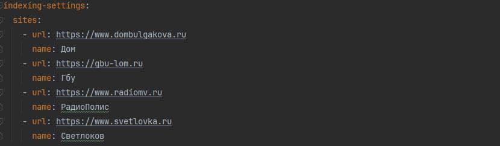
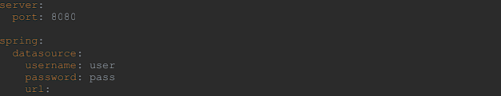
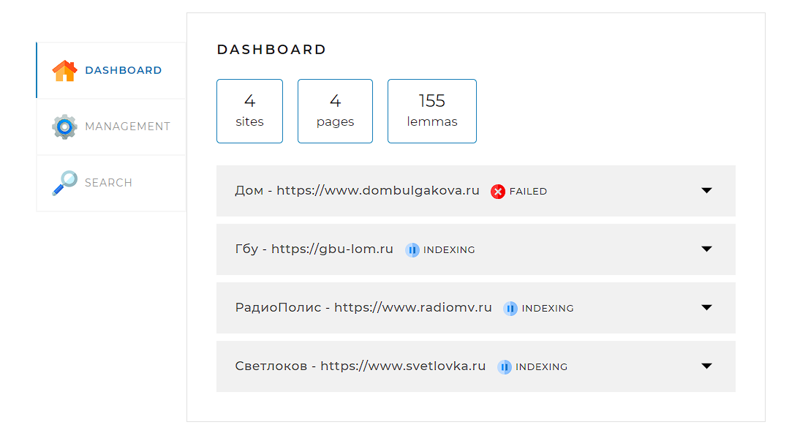
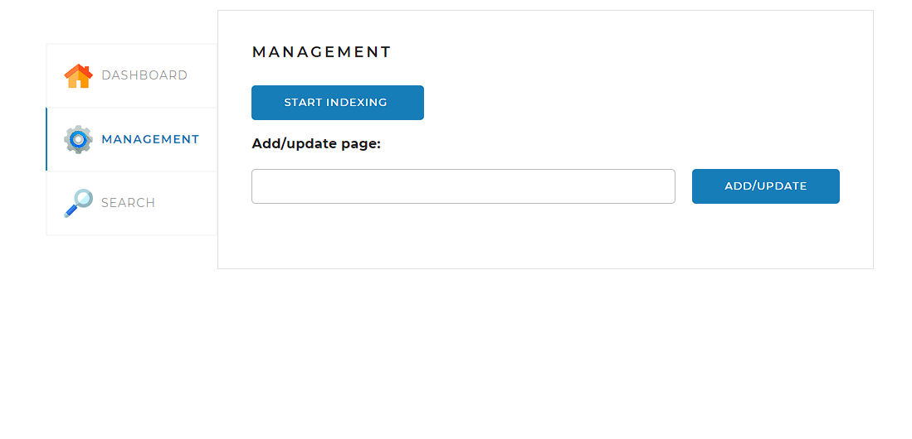
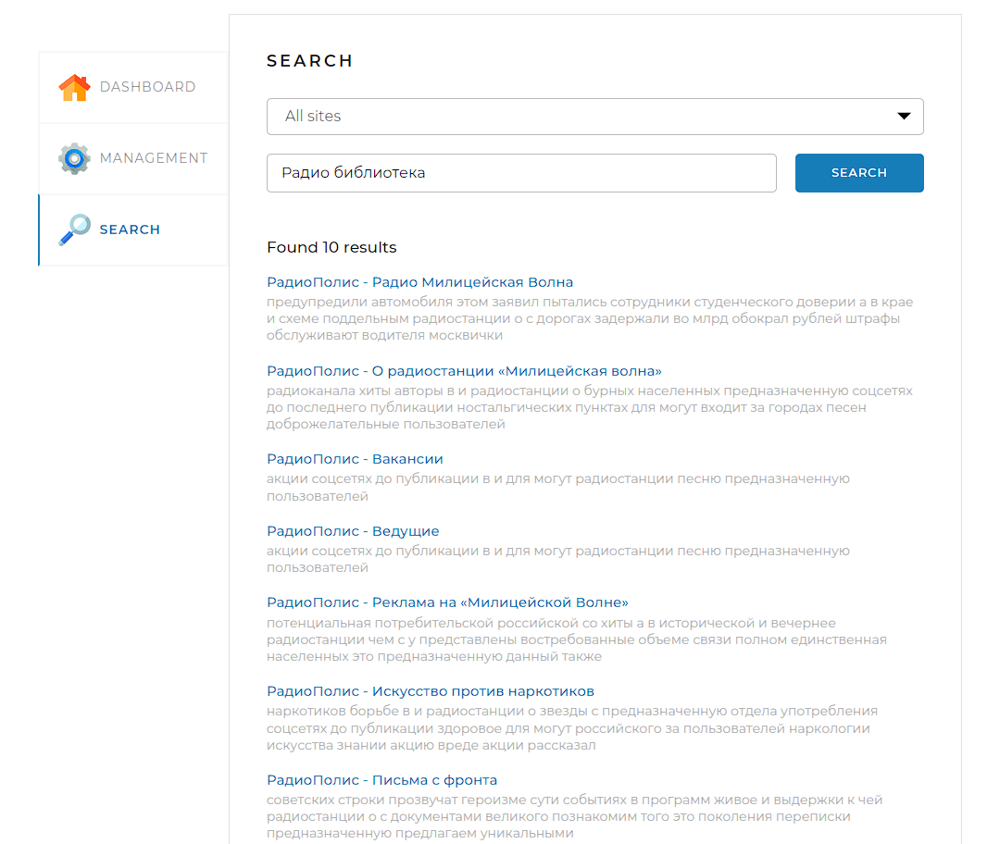

# SearchEngine

SearchEngine - это поисковый дивжок который позволяет индексировать сайты и выполнять поиск по ключевым словам. 

## Стэк
* Java 17
* Spring
* MySQL 8

## Инструкция
### Заполнить application.yaml 
* Сайтами для индексации 

* подключить локальную БД 

### Использование приложения
открыть в браузере http://localhost:8080 
* вкладка DASHBOARD, 
* отображает статусы индексации сайтов 

* вкладка MANAGEMENT
*  START INDEXING - запускает индексацию всех сайтов из application.yaml
*  STOP INDEXING - останавливает индексацию всех сайтов
*  Add/update - запускает добавление, обновление индекса страницы сайта

* вкладка SEARCH
* осуществляет поиск страниц по переданному поисковому запросу (поле query).

